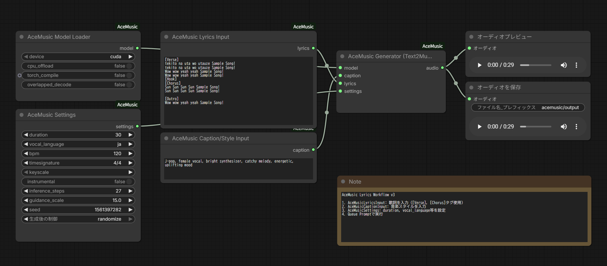

# ComfyUI-AceMusic

**[English](README.md)** | **日本語**

[ACE-Step 1.5](https://github.com/ace-step/ACE-Step)を使用したComfyUI向け多言語AI音楽生成ノード。日本語、英語、中国語、韓国語など19言語で歌詞付きの楽曲を生成できます。



## 特徴

- **多言語歌詞対応** - 19言語（日本語、英語、中国語、韓国語、スペイン語など）でボーカル付き音楽を生成
- **楽曲構造制御** - [Verse]、[Chorus]、[Bridge]などのセクションマーカーで楽曲構造を定義
- **スタイルタグ** - ジャンル、ボーカルタイプ、ムード、テンポ、楽器を制御
- **最大4分の楽曲** - 最大240秒の連続オーディオを生成
- **オーディオ編集** - Cover、Repaint、Extend、Edit、Retake機能
- **LoRAサポート** - 特殊スタイル用のファインチューニングアダプターをロード
- **HeartMuLa互換** - HeartMuLaノードとシームレスに連携

## ノード一覧

| ノード | 説明 |
|--------|------|
| **Model Loader** | ACE-Stepモデルのダウンロードとキャッシュ |
| **Settings** | 生成パラメータの設定（duration、language、BPMなど） |
| **Generator** | キャプションと歌詞から音楽を生成（Text2Music） |
| **Lyrics Input** | セクションマーカー付き歌詞入力専用ノード |
| **Caption Input** | スタイル/ジャンル説明入力専用ノード |
| **Cover** | 既存オーディオを別スタイルに変換（Audio2Audio） |
| **Repaint** | オーディオの特定セクションを再生成 |
| **Retake** | 既存オーディオのバリエーションを作成 |
| **Extend** | オーディオの先頭または末尾に新コンテンツを追加 |
| **Edit** | メロディを保持しながらタグ/歌詞を変更（FlowEdit） |
| **Conditioning** | パラメータをConditioningオブジェクトに結合 |
| **Generator (from Cond)** | Conditioningオブジェクトから生成 |
| **Load LoRA** | ファインチューニングされたLoRAアダプターをロード |
| **Understand** | 既存オーディオからメタデータを抽出 |
| **Create Sample** | 自然言語クエリからパラメータを生成 |

## インストール

### ComfyUI Manager（推奨）

"ComfyUI-AceMusic"で検索してインストール。

### 手動インストール

```bash
cd ComfyUI/custom_nodes
git clone https://github.com/hiroki-abe-58/ComfyUI-AceMusic.git
cd ComfyUI-AceMusic
pip install -r requirements.txt
```

### ACE-Step 1.5のインストール

```bash
pip install git+https://github.com/ace-step/ACE-Step.git
```

モデルは初回使用時にHugging Faceから自動ダウンロードされます。

## クイックスタート

1. **AceMusic Model Loader**ノードを追加し、デバイスを選択（`cuda`）
2. **AceMusic Settings**ノードを追加してパラメータを設定
3. **AceMusic Lyrics Input**ノードを追加して歌詞を入力：
   ```
   [Verse]
   君の声が聞こえる
   遠い空の向こうから
   
   [Chorus]
   光の中で
   二人歩いてゆこう
   ```
4. **AceMusic Caption Input**にスタイルタグを入力：`j-pop, female vocal, energetic`
5. すべてを**AceMusic Generator** -> **Preview Audio**に接続

サンプルワークフローは `workflow/AceMusic_Lyrics_v3.json` からロードできます。

## セクションマーカー

ACE-Stepは楽曲構造用に以下のセクションマーカーをサポート：

| マーカー | 用途 |
|----------|------|
| [Intro] | オープニングのインストゥルメンタルまたはボーカルイントロ |
| [Verse] | メインのヴァース（Aメロ、Bメロ） |
| [Pre-Chorus] | サビ前のビルドアップ |
| [Chorus] | メインフック/サビ |
| [Bridge] | 対照的なセクション（Cメロ） |
| [Outro] | エンディングセクション |
| [Instrumental] | ボーカルなしのセクション |

## スタイルタグ

キャプションでタグを組み合わせて出力スタイルを制御：

- **ジャンル**: pop, rock, electronic, jazz, classical, hip-hop, r&b, country, folk, metal, indie, j-pop, k-pop
- **ボーカル**: female vocal, male vocal, duet, choir, instrumental
- **ムード**: energetic, melancholic, uplifting, calm, aggressive, romantic, dreamy, dark
- **テンポ**: slow, medium, fast
- **楽器**: piano, guitar, drums, synth, strings, bass, violin, saxophone

**例**: `j-pop, female vocal, energetic, bright synthesizer, catchy melody`

## モデルとハードウェア

モデルはHugging Faceから `~/.cache/ace-step/checkpoints/` に自動ダウンロードされます。

### パフォーマンス

| デバイス | RTF（27ステップ） | 1分のオーディオ生成時間 |
|----------|-------------------|------------------------|
| RTX 5090 | ~50x | ~1.2秒 |
| RTX 4090 | 34.48x | 1.74秒 |
| A100 | 27.27x | 2.20秒 |
| RTX 3090 | 12.76x | 4.70秒 |
| M2 Max | 2.27x | 26.43秒 |

### VRAM要件

| モード | VRAM | 備考 |
|--------|------|------|
| Normal | 8GB以上 | フルスピード |
| CPU Offload | 約4GB | 遅いがVRAM制限環境で動作 |

## パラメータ

### Settingsノード

| パラメータ | デフォルト | 範囲 | 説明 |
|------------|------------|------|------|
| duration | 30 | 5-240 | オーディオ長（秒） |
| vocal_language | ja | 19言語 | ボーカルの言語 |
| bpm | 120 | 0-300 | テンポ（0 = 自動） |
| timesignature | 4/4 | 各種 | 拍子 |
| keyscale | (自動) | 24キー | 音楽キー |
| instrumental | false | bool | ボーカルなしで生成 |
| inference_steps | 27 | 1-100 | 品質 vs 速度 |
| guidance_scale | 15.0 | 1-30 | プロンプト準拠度 |
| seed | -1 | int | ランダムシード（-1 = ランダム） |

## 対応言語

ACE-Stepは19言語をサポート。品質上位：

| 言語 | コード | 品質 |
|------|--------|------|
| 英語 | en | 優秀 |
| 中国語 | zh | 優秀 |
| 日本語 | ja | 優秀 |
| 韓国語 | ko | 良好 |
| スペイン語 | es | 良好 |
| ドイツ語 | de | 良 |
| フランス語 | fr | 良 |
| ポルトガル語 | pt | 良 |
| イタリア語 | it | 良 |
| ロシア語 | ru | 良 |

## HeartMuLaとの連携

AUDIO型はHeartMuLaの出力と互換性があります：

- HeartMuLa生成オーディオをAceMusic Coverの入力として使用
- HeartMuLa生成オーディオをAceMusic Repaintの入力として使用
- HeartMuLaとAceMusicノードを連結して高度なワークフローを構築

## トラブルシューティング

### モデルがロードされない / ダウンロード失敗
- インターネット接続を確認
- Hugging Faceへのアクセスを確認
- https://huggingface.co/ACE-Step から手動ダウンロードを試す

### VRAMが不足
- Model Loaderで`cpu_offload`を有効化
- `duration`を減らす
- 他のGPUアプリケーションを閉じる

### 生成が遅い
- `torch_compile`を有効化（tritonが必要）
- `inference_steps`を下げる（ドラフト用に10-15）
- 長いオーディオ（48秒以上）には`overlapped_decode`を使用

### オーディオ品質の問題
- `inference_steps`を上げる（最高品質には50-100）
- `guidance_scale`を調整（10-20を試す）
- より詳細なキャプションを提供
- 異なるシードを試す

### Windows固有の問題
- `torchaudio`エラーの場合、`soundfile`をインストール：`pip install soundfile`
- torch.compileにはtritonをインストール：`pip install triton-windows`

## 要件

- Python >= 3.10
- PyTorch >= 2.0.0
- ComfyUI
- ACE-Step 1.5

## ライセンス

Apache 2.0

## クレジット

- [ACE-Step](https://github.com/ace-step/ACE-Step) - ACE StudioとStepFunによるオリジナル音楽生成モデル
- [ComfyUI](https://github.com/comfyanonymous/ComfyUI) - ノードベースUIフレームワーク
- [HeartMuLa](https://github.com/filliptm/ComfyUI_FL-HeartMuLa) - ノードデザインのインスピレーション

## リンク

- [ACE-Step GitHub](https://github.com/ace-step/ACE-Step)
- [ACE-Step Hugging Face](https://huggingface.co/ACE-Step)
- [ACE Studio](https://www.acestudio.ai/)
